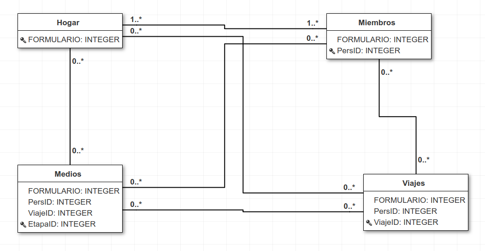

# Posadas
Repositório para trabajar con los datos de movilidad en Posadas, Misiones - Argentina.
Datos originales de investigación del [Proyecto de Transport Urbano para Áreas Metropolitanas (PTUMA)](http://www.ptuma.gob.ar/).

## Organización de la base de datos:
Algunos detalles:

* **Hogar:** Variable `FORMULARIO` es ID, y se trata de la encuesta hecha en el hogar;  
* **Miembros:** Encuesta hecha a cada miembro del hogar; Variables `PersID` es ID;  
* **Viajes:** Cada registros es igual a un viaje completo de un miembro del hogar; Variable `ViajeID` es ID;  
 * La variable `Loc_viaje` vincula las variables `LugarOrigen` (localidad del origen del viaje)  y `LugarDestino` (localidad del destino del viaje), con lo cual resume si el viaje se hizo en su totalidad en la ciudad de Posadas (Posadas), en su totalidad fuera de la ciudad de Posadas pero dentro del Área Metropolitana de Posadas (AMsP) o los viajes que tienen un extremo en la ciudad de Posadas y el otro fuera de ella pero en el AMP (Interzona).  
 *  La variable `Medio_Transporte` resume el uso de los distintos medios en las etapas del viaje.  
 * La variable `motivo_sin_hogar` tienen asignado como motivo del viaje la actividad en el destino, en caso que el destino sea hogar, el motivo se consideró como la actividad en el origen.  

* **Medios:** Cada registro es igual a una etapa de un viaje; Variable `EtapaID` es ID;

:warning: **Para todos: La variable `FEX` se utiliza como factor de expansión para el tratamiento de las variables referidas al hogar;**

  
